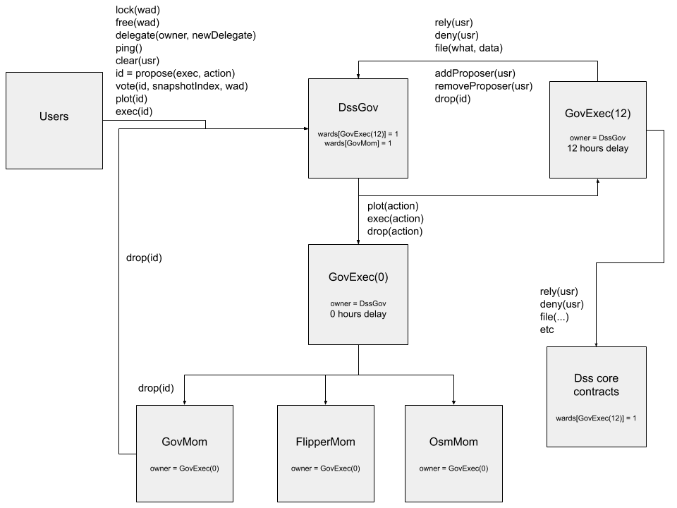

# DSSGov

The Governor Contract, or `DssGov` for short, is a Dai Stablecoin System Contract that authorises Maker governance to make changes to the Maker protocol by supporting on-chain proposals.

## Description

This repository contains three main contracts:

- `DssGov`: actual governance contract

- `GovExec`: contract which acts as a delayer between proposals being approved and getting them executed.

- `GovMom`: contract that has authority to drop proposals in `DssGov`. It will be used together with a `GovExec` with 0 time delay.

## Authorization schema

## Public functions

### rely(address usr)

It is an `auth` function. Authorizes `usr` to execute `auth` functions.

### deny(address usr)

It is an `auth` function. Removes authorization of `usr` to execute `auth` functions.

### file(bytes32 what, uint256 data)

It is an `auth` function. Changes a governance setting.

### addProposer(address usr)

It is an `auth` function. Adds `usr` to the whitelist of regular proposers (which do not need to stake MKR to make a proposal).

### removeProposer(address usr)

It is an `auth` function. Removes `usr` from the whitelist of regular proposers.

### delegate(address owner, address newDelegated)

Delegates the MKR deposited by `owner` to `newDelegated`.

Requires:

- `msg.sender == owner` OR
- `msg.sender == oldDelegated` AND `newDelegated == address(0)` OR
- `msg.sender == ANYONE` AND `newDelegated == address(0)` AND `owner is inactive`

### lock(uint256 wad)

Deposits `wad` amount of MKR

### free(uint256 wad)

Withdraws `wad` amount of MKR

### clear(address usr)

Creates a new snapshot of `usr` with 0 voting weight. Removes the previous weight from total active MKR.

Requires `usr` has been inactive for a certain time and hasn't been already marked as inactive.

### ping()

Creates a new snapshot of `msg.sender` with its delegated amount. Adds this voting weight to total active MKR.

Requires `msg.sender` was previously marked as inactive or it is the first time calling this function.

### launch()

Launches the system. This function is meant to activate the system and just to be used once.

Requires that a minimum amount of MKR is deposited and active in the contract.

### propose(address exec, address action)

Makes a new proposal.

Requires:

- `msg.sender` is a whitelisted proposer and hasn't reached the daily maximum OR
- `msg.sender` has enough MKR deposited and is not a current locked account (due a previous proposal created)

### vote(uint256 id, uint256 snapshotIndex, uint256 wad)

Votes proposal number `id` with `wad` amount of MKR.

Requires passing the correct `snapshotIndex` and having `wad` <= voting rights at that `snapshotIndex`.

### plot(uint256 id)

Schedules proposal number `id`

Requires it has enough votes supporting it.

### exec(uint256 id)

Executes proposal number `id`.

Requires that the proposal has already been scheduled and the delay has passed.

### drop(uint256 id)

It is an `auth` function. Cancels proposal number `id`.

## Some user flows

Users that want to deposit and start voting with their own `wad` amount of MKR:

- `MKR.approve(DssGov, wad)`

- `DssGov.lock(wad)`

- `DssGov.delegate(sender, sender)`

- `DssGov.ping()`

Users that want to deposit and delegate `wad` amount of MKR:

- `MKR.approve(DssGov, wad)`

- `DssGov.lock(wad)`

- `DssGov.delegate(sender, userToDelegate)`

Users that want to start voting with their delegated `wad` amount of MKR for the first time (or after being inactive):

- `DssGov.ping()`
